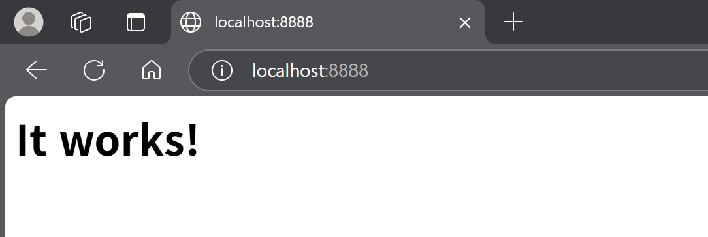
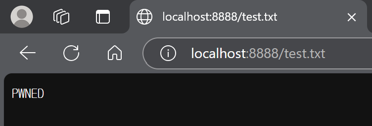
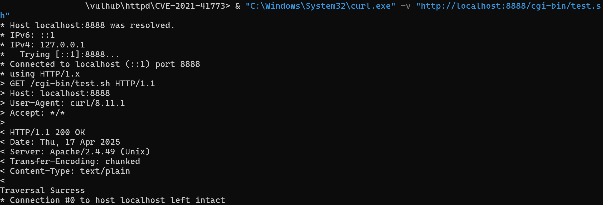
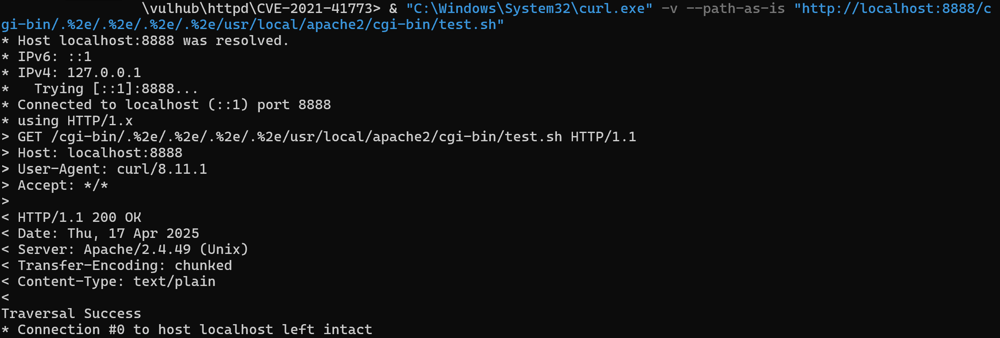

# CVE-2021-41773 | Apache Path Traversal & RCE Vulnerability

## 요약

Apache HTTP Server 2.4.49 버전에서 발생한 **Path Traversal** 및 **원격 코드 실행(RCE)** 취약점이다.  
인증 없이 특수한 경로(`.%2e/.%2e/`)를 사용하여 서버 파일에 접근하거나, 스크립트를 실행할 수 있다.  
패치되지 않은 Apache 2.4.49 환경에서 공격자가 서버 제어를 탈취할 수 있다.
- 영향 버전: Apache HTTP Server 2.4.49
- 패치 버전: Apache HTTP Server 2.4.50 이상


## PoC 구성

- Docker 환경에 Apache 2.4.49를 설치
- `cgi-bin` 디렉토리에 스크립트를 두고, Traversal 공격을 시도
- 최종적으로 명령어를 실행하여 파일을 생성 및 내용을 확인

공격 흐름:

1. 서버가 정상 구동되는지 확인
2. 파일에 접근 시도 (Path Traversal)
3. Shell 스크립트 생성 및 업로드
4. 명령어 실행 시도


## 환경 구성 및 실행

```powershell
# 컨테이너 생성
docker-compose up -d

# 컨테이너 접속
docker exec -it cve-2021-41773-apache-1 /bin/bash

# cgi-bin 디렉토리로 이동하여 스크립트 작성
cd /usr/local/apache2/cgi-bin
echo -e '#!/bin/bash\necho Content-Type: text/plain\necho\necho Traversal Success' > test.sh
chmod +x test.sh

# 컨테이너 종료
exit

접속 주소: http://localhost:8888
사용 포트: 8888
컨테이너 이름: cve-2021-41773-apache-1
```

##결과
#1. Apache 서버 정상 접속


# 2. 업로드한 PWNED 텍스트 파일 접근


# 3. 초기 Path Traversal 실패 (404 또는 500)


# 4. Traversal로 test.sh 접근 성공


# 5. Traversal 없이 test.sh 직접 접근 성공


##정리
Path Traversal 시도를 통해 /cgi-bin/ 디렉토리 내부 파일에 접근할 수 있음을 확인했다. 처음에는 정적 파일 접근(예: test.txt) 시도가 실패했지만, 실행 가능한 스크립트 파일(test.sh)을 통해 명령어 실행이 성공했다. Traversal 기법을 사용하여 실제 시스템 명령어가 실행된 것을 증명했으며, 이를 통해 취약점이 심각한 영향을 미칠 수 있음을 확인했다.